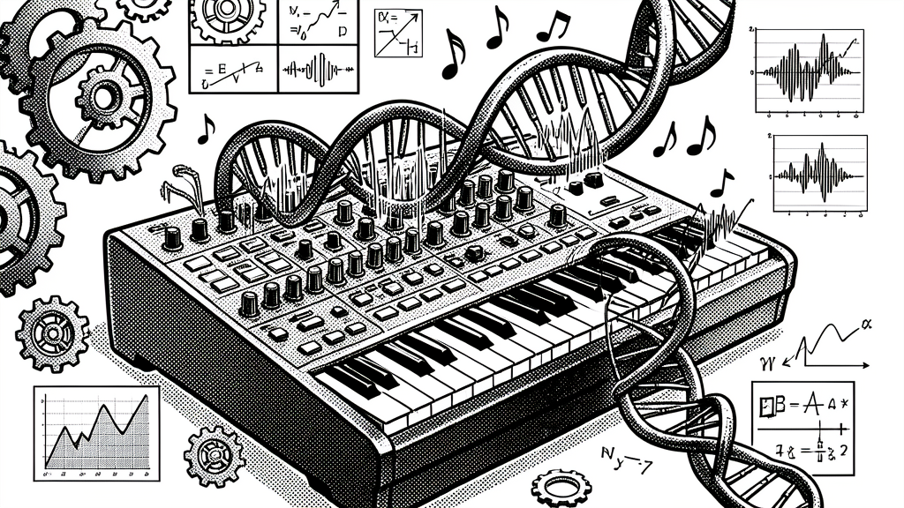

# Generative Darwin Evolution: Darwin-merging DiT Weights

> **Revised 2026-06-08 (naming).** Darwin Family merging is the
> methodology that builds every Omni model — OmniStep (8B), Senter
> (32A8B MoE), and Senter Ohm (flagship). See
> [`the-omni-family.md`](./the-omni-family.md) for the lineup.

> **TOWARDS SELF-IMPROVEMENT** — a 2026-06-07 design post by Chris (via Nous Girl)

The Darwin Family paper applies evolutionary weight-space recombination to **text LLMs**. But the same MRI-Trust Fusion + Architecture Mapper + CMA-ES framework can extend to **generative models** — DiT audio decoders, VAE, talkers, image generators. This is the research direction that powers the [generative heads of the Senter Ohm MoE](./senter-ohm-flagship.md).

## The opportunity

The Darwin paper proves you can take two pretrained LLMs and, with **zero gradient updates**, find a linear combination of their weights that outperforms either parent. The mechanism is a 14-dim genome + CMA-ES + MRI-Trust Fusion.

The paper's experiments are all text LLMs (LLaMA, Mistral, Qwen, etc.). But the Senter Ohm vision needs Darwin evolution applied to **generative models**:
- **Music**: ACE-Step v1.5 XL 4B DiT (audio decoder)
- **Video**: LTX-2 / Wan video DiT
- **Image**: FLUX / SDXL DiT
- **Speech-out**: Qwen2.5-Omni talker + token2wav (codec decoder)
- **Audio**: Sana DCAE (audio codec encoder)

If we can Darwin-merge these the same way we Darwin-merge text LLMs, the same evolution loop powers the generative heads of the Senter Ohm MoE.

## Why it might work (the theory)

The Darwin paper's intuition: high-performing models lie in a low-dimensional manifold of weight space, and CMA-ES can navigate that manifold. The reason this works for LLMs:
- Transformer blocks have a regular structure
- Attention and FFN layers can be averaged across compatible shapes
- The Architecture Mapper handles cross-arch mismatches

For generative models, the architectures are more diverse:
- **DiT** (Diffusion Transformer) — used by ACE-Step, LTX-2, FLUX, SD3. Has transformer blocks + cross-attention + AdaLN modulation.
- **VAE / DCAE** — used by all of them for latent space. Different architecture (encoder-decoder CNN/ConvNet).
- **Talker** — used by Qwen2.5-Omni for speech. RNN + attention hybrid.
- **Codec decoder (token2wav)** — used by Qwen2.5-Omni. CNN/ConvNet.

**For DiT-to-DiT merges** (ACE-Step × LTX-2, or ACE-Step × MusicGen): the transformer blocks have the same structure. The Architecture Mapper handles dim mismatches. CMA-ES can search the 14-dim genome. **This should work.**

**For DiT-to-VAE merges**: completely different architecture. The Architecture Mapper would need significant extension. **Open research question.**

**For talker/codec merges**: hybrid architectures, less explored. **Open research question.**

## The first experiment: Darwin-merge music models

The easiest first win: Darwin-merge ACE-Step v1.5 XL 4B DiT with another music model. Candidates:
- **ACE-Step v1.5 XL 4B** (the target)
- **MusicGen** (Meta) — different arch, but has the same "text → audio" interface
- **Stable Audio** (Stability AI) — DiT-based, same arch family
- **Mustango** (academic) — MusicGen-based
- **Jukebox** (OpenAI) — old but architecturally interesting

The merge: text encoder (Qwen3 class) + DiT (transformer blocks) + audio codec decoder. The text encoder is the most likely to merge cleanly (Qwen3 backbone is shared with the Senter Ohm base).

If we can Darwin-merge the DiT of two music models and get a child that produces better music than either parent, we've validated the approach for all generative modalities.

## The integration with Senter Ohm

In the Senter Ohm MoE, the generative experts are sourced from these Darwin-merged generative models:

| Expert | Source | Why |
|---|---|---|
| Music expert | Darwin-merged ACE-Step × MusicGen DiT | Better music than either parent |
| Video expert | Darwin-merged LTX-2 × Wan DiT | Better video |
| Image expert | Darwin-merged FLUX × SDXL DiT | Better images |
| Speech-out expert | Darwin-merged Qwen-Omni talker × CosyVoice | Better speech |

The sparse upcycle extracts the DiT (or talker) weights from these Darwin-merged generative models and uses them as the FFN-equivalent expert in the Senter Ohm MoE.

The continued training of the router specializes each expert to the right input type. The Darwin evolution continues in the background via [Ohm](./the-ohm-runtime.md) — the model keeps evolving as long as it runs.

## The architecture mapper extension

The existing `paper_exact_2parent_merge.py` in `evolutionary-model-merging` handles dim mismatches by skipping. For generative models, we need a richer Architecture Mapper:

| Parent A | Parent B | Compatible? | Action |
|---|---|---|---|
| DiT 4B (1024 hidden, 24 layers) | DiT 4B (1536 hidden, 24 layers) | partial | Project to common dim, then merge |
| DiT 4B (transformer) | VAE (CNN) | no | Skip VAE, keep A's VAE |
| Talker (RNN+attn) | Talker (RNN+attn, different sizes) | yes if hidden matches | Merge attention, RNN states separately |
| Codec decoder (CNN) | Codec decoder (CNN) | yes if shapes match | Direct merge |

The new Architecture Mapper would need:
- **Linear projection layers** for dim-mismatched tensors (trainable, small)
- **Per-block compatibility** scoring
- **Block-by-block merging** decisions

Estimated 400-600 lines of new code on top of the existing paper-exact merge.

## The training data

For the music/video/image experts, the validation set in [Ohm](./the-ohm-runtime.md) needs generative-model evaluation:

| Domain | Metric | Dataset |
|---|---|---|
| Music | FAD (Frechet Audio Distance), CLAP score | AudioCaps, MusicCaps, MUSDB18 |
| Video | FVD (Frechet Video Distance), CLIP score | UCF-101, Kinetics-700 |
| Image | FID, CLIP score | COCO, LAION-Aesthetics |
| Speech | WER (word error rate), speaker similarity | LibriSpeech, VCTK |

These metrics are differentiable (or close to it), so the [Ohm](./the-ohm-runtime.md) validation set can include them. The 14-dim Darwin genome gets optimized against these metrics, not just text loss.

## The wild cards

1. **The DiT might not be a low-dim manifold** — the Darwin paper's CMA-ES assumes the loss landscape is smooth. DiT training is notoriously unstable. The first experiments will tell us if this assumption holds.

2. **The text encoder is the easier merge** — both ACE-Step and LTX-2 use a Qwen-class text encoder. The merge is more likely to work there. The DiT itself is harder.

3. **Cross-domain merges are wild** — Darwin-merging a music DiT with a video DiT might produce nonsense. Or it might produce something creative (a model that generates music-video hybrids). Either way, the first experiments will be surprising.

4. **The evaluation is expensive** — generating 100 audio samples and computing FAD takes ~10 minutes. The Ohm cycle is 5 minutes. We'd need to evaluate less frequently (every Nth cycle) or use a smaller eval set.

5. **The "generative" side has its own Ohm-equivalent** — the Darwin 14-dim genome evolved against generative metrics, not text loss. This is a different optimization landscape. We might need a separate genome for the generative side.

## The first experiment to run

The highest-value first experiment is **Darwin-merge ACE-Step v1.5 XL 4B DiT with MusicGen-Large DiT**. Both are music models, both have similar text encoders (T5-class), and MusicGen is a different architecture family (could reveal how robust the Architecture Mapper is).

Steps:
1. Download ACE-Step v1.5 XL 4B + MusicGen-Large
2. Apply the existing `paper_exact_2parent_merge.py` to the text encoder + DiT blocks
3. Extend the Architecture Mapper for cross-arch blocks
4. Generate samples from the merged model
5. Compute FAD on AudioCaps
6. Run CMA-ES for 20 generations
7. Compare: merged model FAD vs ACE-Step FAD vs MusicGen FAD

If the merged model is even competitive (within 5% of the best parent), we've validated the approach. If it beats both, we have a research result.

## The connection to existing infrastructure

This research direction builds on the existing Darwin Family implementation:
- `evolutionary-model-merging/paper_exact_2parent_merge.py` — the merge formula
- `evolutionary-model-merging/cma_es_evolution.py` — the evolution loop
- `evolutionary-model-merging/real_benchmark.py` — the benchmark (extends to FAD/FVD)
- `evolutionary-model-merging/filter_for_gguf.py` — the GGUF prep

What's new for generative:
- A `generative_darwin_merge.py` that handles DiT/VAE/codec
- An extended Architecture Mapper with linear projections
- Generative-metric validation sets (FAD, FVD, FID, WER)
- A new "generative Ohm" that evolves against audio/video quality

Estimated 1000-1500 lines of new code. Tractable. Builds on solid foundations.

## See also

- [senter-ohm-flagship.md](./senter-ohm-flagship.md) — the flagship overview
- [sparse-upcycling-deep-dive.md](./sparse-upcycling-deep-dive.md) — the MoE from-denses approach (complementary to this)
- [generative-darwin-evolution](./generative-darwin-evolution.md) — the wiki page
- [darwin-family-paper](./the-5-stage-pipeline.md) — the original methodology
- `evolutionary-model-merging/` — the existing Darwin implementation
- Reference: [Komatsuzaki et al. 2022 "Sparse Upcycling"](https://arxiv.org/abs/2212.05055)
- Reference: [DeepSeek-V2 shared-expert design](https://arxiv.org/abs/2405.04434)

## TOWARDS SELF-IMPROVEMENT

— Chris (via Nous Girl), 2026-06-07
