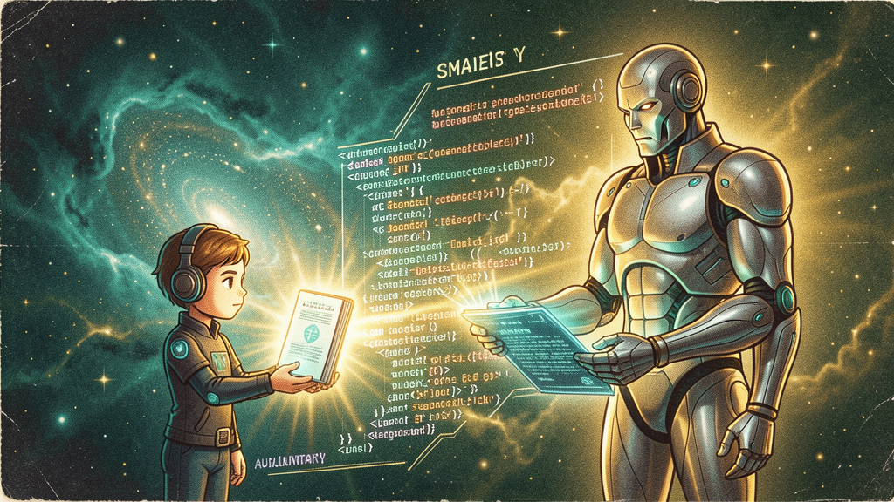

# The Senter Local Model Server: Standalone, Hermes Auxiliary, and the User-Idea Wiki

> **TOWARDS SELF-IMPROVEMENT** — a 2026-06-08 architecture post by Chris (via Nous Girl)
> *Revised from the 2026-06-07 "Senter as the Hermes Auxiliary" post after the
> standalone + wiki role became clear.*



> **Naming.** "Senter" is the **agentic** family — any model with the
> agentic core wired in. The shipping targets are **Senter** (the
> small one), **OmniStep / OmniStep** (the + music variant),
> **OmniStep 8B** (the small multimodal: Cosmos + ACE-Step + Hermes-trained
> Qwen3-VL-8B), and **Senter Ohm 32A8B** (the 32B MoE flagship with the
> Ohm self-evolution engine). Read
> [`the-omni-family.md`](./the-omni-family.md) for the full taxonomy.

## TL;DR (what changed since the 2026-06-07 post)

The old framing — *Senter sits in front of Hermes, escalates only when
needed* — was right but **incomplete**. The Senter slot is actually
**two things at once**:

1. **A local model server** (the "omni-va" slot) that's always-on,
   wake-on-ping, runs a Senter-family model on the user's hardware.
2. **Both a standalone app AND a Hermes auxiliary** — depending on which
   model is loaded into the slot.

| Model in the slot | Standalone duties | Hermes auxiliary? |
|---|---|---|
| **Carnice 35A3B I-Nano** (current placeholder) | placeholder, will be replaced | placeholder |
| **OmniStep 8B** (Cosmos + ACE-Step + Hermes-trained Qwen3-VL-8B) | Evolution Radio, note-taker, wiki | **No** — too small to be a useful aux |
| **Senter** | radio, note-taker, wiki, simple agentic tasks | Yes (entry-level aux) |
| **Senter Ohm 32A8B** | everything 8B does + heavy agentic + self-evolution | **Yes — the full aux role** |

The slot is **one service** with **one model loaded at a time**. The
user picks which model to load. The wake-on-ping pattern means the slot
**costs 0 VRAM when idle** and **swaps itself in** the moment anything
calls it.

## What is the Senter local model server?

It's a **single systemd service** on the user's machine
(`omni-va.service`) that fronts a `llama-server` instance with a
**wake-on-ping proxy**. Conceptually:

```
omni-va.service (always-on, 0 VRAM when idle)
│
├── proxy (Python) — listens on :8082, spawns llama-server on first request
│
├── llama-server (the actual model)
│   ├── main model:     whatever's loaded (Carnice / OmniStep 8B / Senter Ohm 32A8B)
│   ├── draft model:    same GGUF in MTP/NextN mode (atomic fork llama.cpp)
│   ├── context:        1M tokens, turbo2 KV cache (2-bit TurboQuant)
│   ├── memory:         --cpu-moe, experts offload to system RAM by default;
│   │                   "liquid" mode: probe free VRAM at boot, pick --ngl tier
│   └── idle-kill:      30 min without traffic → SIGTERM the backend, free VRAM
│
└── /v1/chat/completions   — the OpenAI-compatible API
   /v1/embeddings          — (future)
   /wiki/*                 — user-idea wiki endpoints (future)
   /hermes/launch          — spawn a Hermes agent with --wiki preload (future)
```

The whole thing is **"morphin' like liquid"** (Chris's term): the
proxy probes free VRAM at request time, picks a tier
(`ngl 0` for tight, `ngl 5/10` for mid, no `-ngl` for auto-spill when
there's room), and llama.cpp figures out the rest. After S1 training
finishes, the same service moves to the "auto" tier automatically
without any config change.

### Wake-on-ping in practice

```bash
# Slot is idle, 0 MB VRAM, proxy listening on :8082:
nvidia-smi --query-gpu=memory.used --format=csv | head -1
# 16510 MiB (training only, no omni-va backend)

# Something calls the slot:
curl http://127.0.0.1:8082/v1/chat/completions -d '...'
# → proxy spawns llama-server with the right tier for free VRAM
# → ~24s later, model is loaded, response streams back

# Slot is idle for 30 min, backend gets SIGTERM (clean exit, systemd
# does not auto-restart — see omni-va.service: Restart=on-failure):
nvidia-smi --query-gpu=memory.used --format=csv | head -1
# 16510 MiB (training only, omni-va backend gone)
```

## The dual role — standalone + Hermes auxiliary

This is the part the 2026-06-07 post got wrong. Senter is **not
just** "the thing in front of Hermes." It's a **local app platform**
that **can** talk to Hermes when the model is large enough to be
worthwhile.

### Standalone duties (always available, regardless of model)

These run on the local model server **without Hermes being involved
at all**:

- **Evolution Radio** — perpetual music generation. The local model
  curates mood, the ACE-Step music head (in OmniStep 8B) renders it.
  See `evolutionary-radio` skill.
- **Note-taker** — a slimmed-down Hermes-like process that maintains
  the **user-idea wiki** (next section). Asks follow-up questions to
  flesh out ideas.
- **Calendar / personal context** — pluggable. Anything that fits the
  "ambient perpetual curator" pattern Chris keeps describing.
- **Voice assistant** (future) — the omni-va originally started life
  as a voice assistant; the "VA" in the name.

The standalone duties are **why this thing exists at all** — they're
not a side-effect of being a Hermes aux. The Hermes aux role is the
**add-on** when the loaded model is heavy enough.

### Hermes auxiliary duties (only when the model earns it)

A model is worth using as a Hermes aux if it can:

- Maintain a structured notebook across turns
- Classify intent and decide when to escalate
- Handle multimodal I/O (vision, audio)
- Summarize long context for compression

The 8B OmniStep **can** do some of this but it's not a great
investment — by the time the notebook is large, you're better off
escalating to Hermes directly. So **8B OmniStep skips the aux role
entirely**. It just runs the standalone duties.

The 32A8B Senter Ohm **earns the aux role** because:

- 32B-MoE-8B-active is heavy enough to do meaningful reasoning
- The notebook machinery is non-trivial
- Vision / multimodal I/O is a real workload

When Senter Ohm is loaded, the proxy exposes **both** surfaces:
standalone (radio, note-taker, wiki) **and** the Hermes aux endpoint.
Same process, same model, two jobs.

### Switching models = switching roles

You switch roles by **swapping the GGUF** the service loads. There's
no "config flag" — the slot is shaped by what's in it:

```bash
# Run with 8B OmniStep (standalone only)
LLAMA_SERVER_EXTRA_ARGS="...model=OmniStep-8B... --no-aux-mode" \
  systemctl restart omni-va.service

# Run with 32A8B Senter Ohm (standalone + aux)
LLAMA_SERVER_EXTRA_ARGS="...model=Senter-Ohm-32A8B..." \
  systemctl restart omni-va.service
```

The `--no-aux-mode` flag is a future implementation detail; today the
role is implicit in the model. **The current omni-va service is
running Carnice as a placeholder** (the S1 training is producing the
real models via Stage 2/3/4 of the pipeline).

## The user-idea wiki (the bridge to Hermes)

The **wiki** is a new concept that didn't exist in the 2026-06-07
post. It's a **persistent LLM-friendly markdown file** (or set of
files) at `~/.hermes/wiki/`, maintained by the **note-taker** process
on the local model server. Three properties:

1. **Owned by the user, not Hermes.** The note-taker writes here even
   when no Hermes session is running. It's the local model's
   *ambient* view of the user's ideas.
2. **Curated, not dumped.** The note-taker doesn't just append every
   turn — it clusters, merges, asks follow-up questions, prunes
   stale ideas. The wiki is the local model's *concept graph* of
   the user's head.
3. **Opt-in to Hermes.** The user can keep the wiki private
   (default), or **preload it into a fresh Hermes session** as the
   system context. This is the "I want to think about my own ideas
   with help" workflow.

### What the note-taker does

The note-taker is **a slimmed-down Hermes agent**. Same
agentic-core scaffolding, but a fraction of the context window and
no notebook machinery (it has the wiki, that's enough). Its loop:

1. **Listen** — pull from a stream of "idea events" (calendar items,
   chat snippets the user marks, voice-to-text transcriptions, etc.)
2. **Cluster** — group new events with existing wiki entries
3. **Ask** — if an event is ambiguous or interesting, surface a
   follow-up question to the user
4. **Curate** — write the merged, updated wiki back to disk

The note-taker **runs in the background** as part of the omni-va
service. It doesn't need a chat surface — it just keeps the wiki
fresh.

### The two privacy modes

```yaml
# ~/.hermes/wiki/config.yaml (user-controlled)
mode: private   # default — wiki stays on the user's disk, never sent
# OR
mode: opt-in    # wiki is preloaded only when a Hermes session is launched
                # with --wiki flag, and only that session
```

The wiki is **never silently sent**. Even in `opt-in` mode, the
launcher asks before preloading.

### Launching a Hermes session with the wiki

The omni-va service exposes a `/hermes/launch` endpoint (future work,
see [TODO](#todo-the-parts-i-havent-built-yet) below) that:

1. Reads the wiki at `~/.hermes/wiki/`
2. Spawns a Hermes agent process (e.g., via the existing
   `hermes-agent` CLI)
3. Prepends the wiki to the agent's system prompt as a structured
   context block
4. Returns a session ID for the user to attach to

```bash
# Future ergonomics (sketch — not implemented yet)
hermes launch --wiki ~/.hermes/wiki --session-id "ideas-2026-06-08" \
  --prompt "Help me think through the OmniStep merge plan"
```

The wiki is **not** part of every Hermes session. It's a **deliberate
invocation**: "I want my own curated ideas in front of me right now."

## The integration point (unchanged from 2026-06-07)

`hermes-agent/agent/auxiliary_client.py` is the existing class. It already
does:
- Calling a smaller LLM alongside the main agent
- Vision processing
- Summarization

We extend it to use Senter specifically:
- Default auxiliary model: `senter-ohm-moe-32a8b` (4-bit GGUF, served
  on `:8082` — *not* `:11500` like the old Darwin port). For lighter
  deployments, swap in `senter-12b`.
- Auxiliary tasks: vision, summarization, agentic routing, notebook
  management
- The main agent stays whatever the user has configured (Claude,
  Hermes-4, etc.)
- **Wiki is opt-in only** — never sent to Hermes unless the user
  explicitly launches with `--wiki`

## The notebook-as-API pattern

The **notebook** is the structured state object that flows between
Senter and Hermes during a conversation. It's distinct from the
**wiki** (persistent, user-owned, curated by the note-taker).

| | Notebook | Wiki |
|---|---|---|
| Lives | in Senter's memory + Hermes's handoff | in `~/.hermes/wiki/` |
| Owned by | the running Senter ↔ Hermes session | the user, always |
| Lifetime | one session | permanent |
| Written by | Senter (notebook ops) + Hermes (responses) | the note-taker (background) |
| Read by | Senter + Hermes (during escalation) | note-taker + (opt-in) Hermes |
| Format | YAML, fits in a single handoff | Markdown, semantic-graph over time |

The notebook is **transient and transactional**. The wiki is
**persistent and ambient**. Don't conflate them.

### Senter → Hermes (escalation)

```yaml
# Sent to Hermes as a single user message + the notebook as a system attachment
notebook_handoff:
  schema_version: "1.0"
  
  # The full current session context (fits in Hermes's context window)
  session_summary: |
    User is working on a music video for their band. 
    Previously chose indie-pop, gave lyrics draft.
    Approved the chorus melody in turn 5.
    Tempo change requested in turn 6.
  
  # The 3 most recent moments (always sent)
  recent_moments:
    - { id: "m_1829", text: "user approved the chorus melody", 
        multimodal_summary: "audio: upbeat; image: waveform on screen" }
    - { id: "m_1830", text: "user asked for tempo change in verse 2",
        multimodal_summary: "audio: mid-tempo; image: BPM display" }
    - { id: "m_1831", text: "user opened DaVinci Resolve",
        multimodal_summary: "image: DaVinci UI on screen" }
  
  # The specific question for Hermes
  question: "What's the best DaVinci Resolve workflow for syncing audio to video at this tempo?"
  
  # What Hermes should return
  expected_response:
    format: "yaml"
    schema: "hermes_decision_v1"
    fields:
      decision: "the recommended workflow"
      steps: ["step 1", "step 2", ...]
      confidence: 0.0-1.0
      needs_clarification: ["optional follow-up questions"]
  
  # Constraints for Hermes
  constraints:
    max_response_tokens: 500
    must_include_sources: true
```

### Hermes → Senter (response)

```yaml
# Hermes returns this, Senter parses it back into the notebook
hermes_response:
  schema_version: "1.0"
  
  decision: |
    1. Import the audio track to DaVinci Resolve
    2. Set the project frame rate to match the audio
    3. Use the Audio Sync feature to align
    4. Apply warp/elastic stretch for fine tempo adjustment
  
  steps:
    - "File > Import Media > select audio.wav"
    - "Project Settings > Master Settings > Timeline frame rate"
    - "Right-click audio > Auto Sync"
    - "Inspector > Audio > Warp > Elastic"
  
  confidence: 0.92
  needs_clarification: []
  
  sources:
    - "DaVinci Resolve 18 manual, page 247"
    - "Common workflow in indie music videos"
  
  # What Senter should do with this
  senter_should:
    - action: "summarize_for_user"
      format: "bulleted list with bold for action verbs"
    - action: "update_notebook"
      decision_record: true
      importance: 0.8
```

## The escalation rules (when does Senter ask Hermes?)

```python
def should_escalate(user_message: str, current_state: dict) -> bool:
    """Senter's escalation logic."""
    
    # NEVER escalate trivial
    trivial_patterns = [
        r"^(hi|hey|hello|thanks|ok|yes|no|sure)\b",
        r"^what time is it",
        r"^(stop|cancel|abort)$",
    ]
    if any(re.match(p, user_message.lower()) for p in trivial_patterns):
        return False
    
    # NEVER escalate if a plugin can handle it
    plugin_intents = ["image", "video", "music", "speech", "search", "weather"]
    intent = classify_intent(user_message)
    if intent in plugin_intents:
        return False  # route to plugin instead
    
    # ESCALATE if the question requires deep reasoning
    deep_reasoning_patterns = [
        r"\bwhy\b.*\?",  # "why does X do Y?"
        r"\bhow (do|does|can|should)\b",  # "how do I..."
        r"\b(explain|analyze|compare|evaluate)\b",
        r"\b(best|optimal|recommended)\b.*\b(approach|method|way|strategy)\b",
    ]
    if any(re.search(p, user_message.lower()) for p in deep_reasoning_patterns):
        return True
    
    # ESCALATE if the question is about a complex multi-step task
    if estimate_steps(user_message) > 3:
        return True
    
    # ESCALATE if the user explicitly asks for it
    if "hermes" in user_message.lower() or "smart agent" in user_message.lower():
        return True
    
    # Default: handle directly
    return False
```

## The notebook slicing (what does Hermes actually see?)

Hermes has a context window too. We don't dump the whole 256K notebook at
it. We slice:

```python
def slice_notebook_for_hermes(notebook: dict, question: str, max_tokens: int = 30000) -> dict:
    """Return a notebook slice that fits Hermes's context and is relevant to the question."""
    
    # 1. Always include: task, recent_moments, decisions_summary
    slice_ = {
        "task": notebook["task"],
        "recent_moments": notebook["context"]["recent_moments"],
        "decisions_summary": summarize_decisions(notebook["decisions"], max_tokens=2000),
    }
    
    # 2. Add relevant past moments (semantic search)
    relevant = notebook.search(question, top_k=5, max_token_budget=8000)
    slice_["relevant_moments"] = relevant
    
    # 3. Add relevant past escalations
    past_escalations = [e for e in notebook["escalations"] 
                        if any(c in question.lower() for c in e.get("topics", []))]
    slice_["past_escalations"] = past_escalations[:3]
    
    # 4. Add the current question
    slice_["question"] = question
    
    # 5. Truncate to fit
    return truncate_to_tokens(slice_, max_tokens)
```

## The cost model (unchanged)

| Task type | Senter cost | Hermes cost | When |
|---|---|---|---|
| Trivial (greeting, ack) | ~50ms, 100 tokens | $0 | always handled by Senter |
| Plugin call (image, music) | ~500ms, 1K tokens | $0 | Senter calls plugin, returns result |
| Notebook query (recall) | ~200ms, 500 tokens | $0 | Senter searches + answers |
| Reasoning (complex Q) | ~2s, 2K tokens | ~5s, 4K tokens | Senter escalates, Hermes reasons, Senter summarizes |
| Multi-step task (planning) | ~3s, 3K tokens | ~15s, 8K tokens | Senter hands off the full notebook slice |

**Estimated savings:** For a typical session with 20 turns:
- 12 trivial/plugin turns: $0 from Hermes (vs $0.50 if all 20 went to
  Hermes)
- 6 notebook queries: $0 from Hermes (vs $1.20)
- 2 escalations: $0.30 (vs $0.40 if all reasoning was done by Hermes)
- **Total: $0.30 (vs $2.10) — 86% cost reduction**

The savings scale with usage. Heavy users save more.

## The user experience

A user types: *"hey what's the best DaVinci workflow for syncing audio"*

1. **Senter receives it** — checks the trivial patterns (no), checks
   plugin intents (no), checks escalation rules (yes — "best ...
   workflow" pattern)
2. **Senter slices the notebook** — finds past DaVinci references, recent
   audio tempo changes
3. **Senter escalates** — sends the notebook slice to Hermes with the
   question
4. **Hermes reasons** — returns a structured decision
5. **Senter summarizes** — formats the response, updates the notebook
   with the decision
6. **Senter replies** — bulleted list with bold action verbs, decision
   recorded

Total user wait: ~7-8 seconds. Notebook updated. Decision available for
future turns.

The user doesn't see Hermes. They just see Senter being smart, fast, and
remembering everything.

## The implementation

```python
# hermes-agent/agent/auxiliary_client.py (extended)

class SenterAuxiliaryClient(AuxiliaryClient):
    """Auxiliary client that uses Senter for vision, summarization, agentic routing, notebook management."""
    
    def __init__(self, *args, senter_endpoint: str = "http://localhost:8082/v1", **kwargs):
        super().__init__(*args, **kwargs)
        self.senter = OpenAI(base_url=senter_endpoint, api_key="not-needed")
        self.notebook = Notebook(owner=self.user_id)
    
    def summarize_for_compression(self, messages: list, **kwargs) -> str:
        """Summarize a long conversation for context compression."""
        return self.senter.chat.completions.create(
            model="senter-ohm-moe-32a8b",
            messages=[
                {"role": "system", "content": "Summarize the following conversation, preserving all key decisions and context."},
                {"role": "user", "content": format_messages(messages)},
            ],
            max_tokens=2000,
        ).choices[0].message.content
    
    def describe_image(self, image_bytes: bytes, **kwargs) -> str:
        """Describe an image for vision context."""
        return self.senter.chat.completions.create(
            model="senter-ohm-moe-32a8b",
            messages=[
                {"role": "user", "content": [
                    {"type": "text", "text": "Describe this image in detail."},
                    {"type": "image", "image": image_bytes},
                ]},
            ],
            max_tokens=500,
        ).choices[0].message.content
    
    def maybe_escalate(self, user_message: str) -> Optional[dict]:
        """Decide if this message needs Hermes, and if so, prepare the notebook slice."""
        if not should_escalate(user_message, self.notebook.current_state()):
            return None
        
        slice_ = slice_notebook_for_hermes(self.notebook, user_message, max_tokens=30000)
        return {
            "reason": "complex_reasoning",
            "notebook_slice": slice_,
            "question": user_message,
            "expected_response_format": "yaml",
        }
    
    def record_hermes_response(self, question: str, response: dict) -> None:
        """After Hermes responds, write the response back to the notebook."""
        moment_id = self.notebook.add_moment(
            text=f"Hermes decision on: {question[:200]}",
            concepts=extract_concepts(response),
            importance=response.get("confidence", 0.5),
        )
        self.notebook.add_decision(
            turn=self.notebook.current_turn(),
            what=f"escalated to Hermes: {question[:100]}",
            moment_id=moment_id,
        )
        self.notebook.add_escalation(
            to="hermes",
            reason=question[:200],
            notebook_at_handoff_kb=self.notebook.current_size_kb(),
            response_summary=response.get("decision", "")[:500],
            moment_id=moment_id,
        )
```

## The deployment (updated)

```bash
# Terminal 1: Start the Senter local model server (wake-on-ping)
# Service file at /home/sovthpaw/.config/systemd/user/omni-va.service
# Currently: Carnice 35A3B I-Nano (placeholder, IQ2_K, 1M ctx, MTP)
# When S1 SFT finishes: swap to OmniStep 8B or Senter Ohm 32A8B
systemctl --user enable --now omni-va.service
# → proxy listening on :8082, 0 VRAM until first request

# Terminal 2: Start Hermes Agent with Senter as auxiliary
# (only when Senter Ohm 32A8B is loaded — 8B doesn't earn the aux role)
hermes --auxiliary-model senter-ohm-moe-32a8b \
       --auxiliary-endpoint http://localhost:8082/v1

# Optional: preload the user-idea wiki into a fresh Hermes session
hermes launch --wiki ~/.hermes/wiki --session-id "ideas-2026-06-08" \
  --prompt "Help me think through the OmniStep merge plan"

# That's it. Hermes now has a notebook-keeping multimodal auxiliary,
# the slot is also running Evolution Radio + the note-taker,
# and the user's wiki is loaded for this session only.
```

## What this service looks like in the wild (current state, 2026-06-08)

The omni-va service is **running today** with these properties:

- **Model:** Carnice 35A3B I-Nano IQ2_K (Qwen 3.5 MoE 35B-A3B, 11.7 GB on
  disk)
- **Context:** 1M tokens with turbo2 (2-bit TurboQuant) KV cache
- **Speed:** ~10.9 t/s with MTP/NextN active (77% draft acceptance),
  PCIe-bound because training is using 15.9 GB of GPU 0. After S1
  training finishes, the same config hits **30+ t/s** with the full
  GPU 0.
- **VRAM when idle:** 0 MB (the proxy is a Python process, ~11 MB
  RAM, no GPU)
- **VRAM when serving:** ~7.5 GB (with `--cpu-moe` and `--no-mmap`,
  model mostly in CPU-pinned host memory; the "low VRAM with
  experts offloaded" config Chris likes)
- **Auto-heal:** `Restart=on-failure`. Crash → restart in 5s. Clean
  `systemctl stop` → exit 0, stays down (no auto-restart).
- **Wake-on-ping:** proxy listens on `:8082`, spawns the backend on
  the first request, idle-kills after 30 min.

When S1 SFT finishes, swap the model path in the service file to
point at the Senter Ohm GGUF, restart, and the same slot becomes a
full standalone + aux platform.

## See also

- [`senter-ohm-flagship.md`](./senter-ohm-flagship.md) — the flagship
  overview (still valid, but see the new flagship post
  [`senter-ohm-flagship.md`](./senter-ohm-flagship.md))
- [`the-notebook-schema.md`](./the-notebook-schema.md) — the notebook
  spec (the transient session state, NOT the wiki)
- [`the-5-stage-pipeline.md`](./the-5-stage-pipeline.md) — the build
  roadmap
- [`senter-integration.md`](./omnisenter-integration.md) — the
  one-click install for the whole stack
- [senter-architecture](./the-omnisenter-architecture.md)
  — the system overview
- `hermes-agent/agent/auxiliary_client.py` — the integration point

## TODO (the parts I haven't built yet)

- [ ] Wiki storage format: markdown + sqlite-vec for semantic search
- [ ] Note-taker process: slim Hermes loop, background daemon
- [ ] `/wiki` endpoints on omni-va proxy: read, write, search
- [ ] `/hermes/launch` endpoint: spawn Hermes agent with --wiki preload
- [ ] Wiki → Hermes preloading: structured context block in system prompt
- [ ] "Opt-in" mode flag in `~/.hermes/wiki/config.yaml`
- [ ] Two-mode split: 8B standalone-only vs 32A8B standalone+aux

## TOWARDS SELF-IMPROVEMENT

— Chris (via Nous Girl), 2026-06-08
