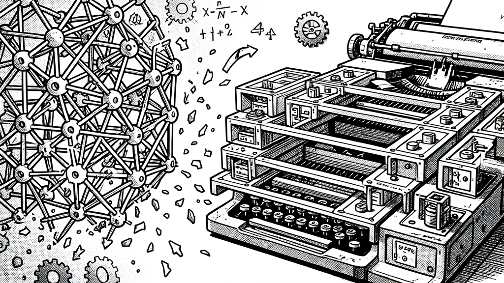

# Sparse Upcycling: Building Senter Ohm's 32B MoE from an 8B Base

> **Revised 2026-06-08 (naming).** The Stage 3 sparse upcycle
> described in this post is what turns **OmniStep** (8B) into
> **Senter** (32A8B MoE) and then **Senter Ohm** (flagship with
> self-evolution). The 32A8B math applies to **Senter** /
> **Senter Ohm**, not to any "OmniSenter 12B" (which is gone).


> **TOWARDS SELF-IMPROVEMENT** — a 2026-06-07 design post by Chris (via Nous Girl)



> **Naming.** This post is about the **Stage 3** build of **Senter Ohm**,
> the ~32A8B flagship. The smaller siblings — **Senter** (small
> function calling + omnimodal fusion) and **OmniStep** (multimodal +
> music) — are dense-ish models and don't go through sparse upcycling.
> Read [`the-omni-family.md`](./the-omni-family.md) for the full taxonomy.

This is the headline technical post of the catalog. **Sparse upcycling**
is the technique that turns an 8B dense model into a 32B MoE with 8B
active per token — the "32A8B" target of Senter Ohm. The math, the
script, the design choices, and the wild cards.

## The problem

You have a trained 8B dense model (the Stage 1 Senter SFT). You want a bigger model — more capable, more knowledgeable, but still fast. Training from scratch is impossible (your 2× 3090 doesn't have the VRAM for full fine-tune of a 30B+ model). Sparse upcycling is the answer.

## The technique

Reference: Komatsuzaki et al. 2022 "[Sparse Upcycling: Training Mixture-of-Experts from Dense Checkpoints](https://arxiv.org/abs/2212.05055)" (Google).

The idea: take a dense transformer block (attention + FFN), copy the FFN **N times** to create N parallel "experts," add a small **router** on top, and continue-train briefly to teach the router which expert to use for which input.

```
BEFORE (dense):
┌──────────────────────┐
│   Self-Attention     │  (50M params)
├──────────────────────┤
│        FFN           │  (150M params)
└──────────────────────┘

AFTER (sparse upcycle, N=4):
┌──────────────────────┐
│   Self-Attention     │  (50M, shared)
├──────────────────────┤
│   ROUTER (top-1)     │  (~few M)
├──────────────────────┤
│   Expert 0 (FFN)     │  (150M)
│   Expert 1 (FFN)     │  (150M)
│   Expert 2 (FFN)     │  (150M)
│   Expert 3 (FFN)     │  (150M)
└──────────────────────┘
```

Per layer: 50M + 4×150M = 650M (was 200M). Across 36 layers + 0.6B embeddings = 24B total (was 8B).

**Active per token (top-1 routing):** 50M + 1×150M = 200M per layer. Across 36 layers + 0.6B embeddings = **~7.8B ≈ 8B**. Same as the original 8B dense model.

So the model has **3× more parameters** (24B vs 8B) but **the same active compute per token** (8B). At inference, only ONE expert fires per layer, so the FLOPs are identical to the dense model — but the model has 3× more *knowledge* baked in across the 4 experts.

## The math (the 32A8B sweet spot)

| N experts | Total params | Active @ top-1 | Active @ top-2 | Disk @ 4-bit | Inference VRAM (1× 3090) |
|---|---|---|---|---|---|
| 1 (dense) | 8B | 8B | 8B | 4GB | 6GB |
| 2 | 13B | 8B | 9.5B | 7GB | 10GB |
| 4 | **24B (24A8B)** | **8B** | 13B | 13GB | 17GB |
| **6** | **35B (32A8B)** | **8B** | 13B | **18GB** | **22GB** |
| 8 | 46B (50A8B) | 8B | 13B | 24GB | 28GB |
| 10 | 57B (57A8B) | 8B | 13B | 30GB | 34GB |

The math:
- Each new expert adds ~5.4B params (the FFN of an 8B model)
- Active per token stays at 8B with top-1 (just pick one expert)
- Adding more experts = more knowledge, same compute

**The sweet spot for Senter Ohm: 5-6 experts = 30-35B total, 8B active.** Fits 4-bit on a single 3090 for inference (18-22GB VRAM), training is tight on 2× 3090 (~50GB peak with QLoRA).

## The shared-expert design (DeepSeek-V2 style)

For N=6 with top-1, we have 6 experts, all routed. But there's a refinement from [DeepSeek-V2](https://arxiv.org/abs/2405.04434): add 1 **always-on shared expert** + N-1 routed experts. The shared expert is small (e.g., 50% of a normal FFN) and always fires. The routed experts are top-1.

```
SHARED + ROUTED (N=4 routed, 1 shared):
┌──────────────────────┐
│   Self-Attention     │  (50M)
├──────────────────────┤
│   SHARED EXPERT      │  (75M, always on)
├──────────────────────┤
│   ROUTER (top-1)     │  (few M)
├──────────────────────┤
│   Routed 0 (FFN)     │  (150M)
│   Routed 1 (FFN)     │  (150M)
│   Routed 2 (FFN)     │  (150M)
│   Routed 3 (FFN)     │  (150M)
└──────────────────────┘
```

Per layer active (top-1): 50M + 75M shared + 150M routed = 275M. Across 36 layers: 9.9B + 0.6B = ~10.5B active.

Hmm — that's bigger than 8B. The shared expert adds to the active count. So the **shared-expert design is best when you can afford ~10-11B active** (the sweet spot of capability vs compute).

For the strict **8B active** target, the design is **no shared expert + top-1 routing** (N=4-6 plain). For **~10-11B active** (still fast, more capable per token), use **shared expert + top-1** (N=3-4 routed).

## The expert sources (what to distill into the experts)

The genius of sparse upcycling is that you don't have to train the experts from scratch — you can **initialize them from existing specialist models** and let the continued training specialize them.

| Expert | Source | Why |
|---|---|---|
| Agentic expert | Stage 2 evolutionary merge | Best for tool use, multi-turn |
| Image/video expert | Distilled from Qwen3-Omni-30B-A3B (in your cache!) | Image + video understanding |
| Audio expert | Distilled from Qwen3-Omni's Whisper/FastConformer | Audio understanding |
| Music expert | Distilled from HeartMuLa or ACE-Step | Music understanding + description |
| Long-context expert | The YaRN-extended Stage 4 anchor | Retrieval at 100K+ tokens |
| Generalist fallback | Copy of base (diversifies via continued training) | Catch-all for unmatched inputs |
| **Synesthesia expert** | Distilled from ImageBind or trained on cross-modal data | The [Synthesia](./the-synthesia-layer.md) cross-modal memory |

The distillation extracts the FFN weights from the source model and uses them as one of the experts. The continued training then specializes each expert (1-5% of Stage 1's training budget = ~1 hour).

## The script (sparse_upcycle.py)

Live at: `multimodal-expansion/scripts/sparse_upcycle.py`

```bash
# The headline command — 8B dense → Senter Ohm 32A8B
python3 sparse_upcycle.py \
    --base-model training-output/senter-ohm-8b-sft-20260606_213858/ \
    --expert-sources \
        models/qwen3-omni-30b-a3b/ \
        models/heartmula/ \
        models/long-context-anchor/ \
        models/synesthesia-expert/ \
    --output training-output/senter-ohm-moe-32a8b/ \
    --num-experts 6 \
    --top-k 1 \
    --shared-expert  # optional, for the 10.5B-active variant
```

The script:
1. Loads the base dense model
2. Finds all FFN blocks (`mlp.gate_proj`, `mlp.up_proj`, `mlp.down_proj` per layer)
3. Creates a MoE FFN with N experts + router
4. Initializes Expert 0 from the base FFN (always)
5. Initializes remaining experts from the `--expert-sources` (if provided) — extracts the matching FFN
6. Initializes the router to uniform + small noise
7. Saves the upcycled model with `upcycle_metadata.json`

The output is a standard safetensors model. Load it with `transformers.AutoModelForCausalLM.from_pretrained()` (with a small monkey-patch for the MoE FFN, or use a custom architecture class).

## The continued training (teaching the router)

The upcycled model needs a SHORT continued training to teach the router. 1-5% of Stage 1's budget:

- Stage 1 was 4268 steps at ~5s/step (with the speed fixes) = ~6 hours
- Continued training: 100-200 steps at 5s/step = ~10-20 minutes

The training data should be a mix:
- 50% agentic data (the original Stage 1 SFT data)
- 20% multimodal examples (text descriptions of images/audio, Q&A)
- 20% specialist data (whatever the experts were distilled from)
- 10% retrieval examples (long-context, notebook-style)

The router is **trained from scratch** (initialized uniform + small noise). The other FFN weights are **frozen** at their source values — we only update the router. This is the magic: the upcycled model converges in 100-200 steps because the experts are already good, only the routing needs learning.

## The wild cards

1. **Expert collapse** — the router might learn to always pick Expert 0 (the base). The fix: add a **load-balancing auxiliary loss** that penalizes uneven expert usage. The script has this.

2. **Catastrophic forgetting** — when you continue-train the router, the expert weights drift. The fix: keep them frozen. Only the router updates.

3. **Router instability** — early in training, the router weights can oscillate wildly. The fix: **router jitter noise** (small random noise added to router inputs during training). The script has this.

4. **Expert quality variance** — if one source model is much better than another, the routing will favor it and the others become dead weight. The fix: use a held-out validation set to monitor per-expert usage. If Expert X is < 5% of tokens, consider dropping it or reinitializing it from a different source.

5. **The shared-expert trade-off** — adding a shared expert increases the active count. For the 8B-active target, skip it. For the 10.5B-active target, include it.

6. **GGUF conversion** — llama.cpp doesn't natively support MoE architectures with custom routers. The fix: write a custom GGUF conversion that flattens the MoE to a multi-expert format. (This is on the roadmap, not done yet.)

## What this enables

A Senter Ohm 32A8B MoE that:
- Fits 4-bit on a single 3090 for inference
- Trains QLoRA on 2× 3090 (tight, but doable)
- Has 4× the knowledge of the dense 8B
- Is fast at inference (8B active = same speed as the dense 8B)
- Hosts [Synthesia](./the-synthesia-layer.md) and [Ohm](./the-ohm-runtime.md) as routed experts

Plus the headline: the [Ohm](./the-ohm-runtime.md) runtime can evolve each expert separately, with the 14-dim Darwin genome applied to the entire MoE.

## See also

- [senter-architecture](./the-omnisenter-architecture.md) — the system overview
- [the-5-stage-pipeline](./the-5-stage-pipeline.md) — sparse upcycle is Stage 3
- [senter-ohm-32a8b-math](./senter-ohm-32a8b-math.md) — the full sizing breakdown
- [synthesia](./the-synthesia-layer.md) — the synesthesia expert that's one of the routed experts
- [senter-ohm](./the-ohm-runtime.md) — the self-evolving runtime that runs on top
- Script: `multimodal-expansion/scripts/sparse_upcycle.py`
- Reference: [Komatsuzaki et al. 2022 "Sparse Upcycling"](https://arxiv.org/abs/2212.05055)

## TOWARDS SELF-IMPROVEMENT

— Chris (via Nous Girl), 2026-06-07
