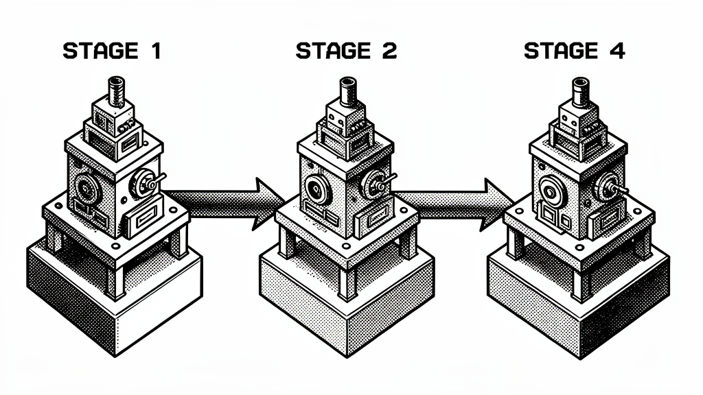

> **Revised 2026-06-08.** Renaming: "Senter Ohm 32A8B" is now just
> **"Senter Ohm"** (the flagship). "OmniSenter 12B" is now **"Senter"**
> (the 32A8B MoE agentic model). "OmniSenterStep" / "Omni SS" is now
> **"OmniStep"** (the 8B with Cosmos + ASR + ACE-Step + agentic). "Omni
> Senter" is the project name, not a model. See
> [`the-omni-family.md`](./the-omni-family.md) for the canonical 4-model
> lineup. Any reference to "12B" or "OmniSenter [as a model]" in this
> post is pre-revision and should be read as referring to Senter (32A8B)
> or OmniStep (8B) per the new naming.

# The 5-Stage Pipeline: Building Senter Ohm

> **TOWARDS SELF-IMPROVEMENT** — a 2026-06-07 design post by Chris (via Nous Girl)



> **Naming.** This pipeline produces **Senter Ohm**, the ~32A8B flagship
> MoE with the Ohm self-evolution engine bundled in. The smaller siblings
> in the family — **Senter** (small function-calling), **OmniStep**
> (multimodal + music), and the Darwin Family children — are produced by
> shorter pipelines. Read [`the-omni-family.md`](./the-omni-family.md) for
> the full taxonomy.

The full build sequence for Senter Ohm. Each stage consumes the artifact
of the previous one. Stage 1 is running right now; the rest are queued.

## The overview

| Stage | What | Input | Output | Wall time (estimated) | Status |
|---|---|---|---|---|---|
| **1** | Agentic Backbone SFT | `gen-0-clean` (8B) | `senter-ohm-8b-sft` | ~6-20h | 🔄 running |
| **2** | Evolutionary Merge | 3 × Senter-8B variants | `senter-ohm-8b-merged` | ~3-4h | ⏳ queued |
| **3** | Sparse Upcycle to MoE | merged 8B + 4-5 specialists | `senter-ohm-moe-32a8b` | ~1h | ⏳ queued |
| **4** | 256K YaRN Context | MoE 32A8B | `senter-ohm-moe-32a8b-256k` | ~2-4h | ⏳ queued |
| **5** | Plugin + Notebook + Ohm Wiring | MoE 32A8B 256K | Deployable `.ohm` bundle | ~1 day | ⏳ queued |

**Total wall time: ~3-5 days from Stage 1 finish to deployable.**

## Stage 1: Agentic Backbone SFT (NOW)

**Goal:** Take a base dense model and train it to be an agentic,
tool-using, notebook-aware assistant.

- **Base model:** `evolution/gen-0-clean` (Cosmos3×Qwen3-8B merge, 8.19B
  params, 40K native context)
- **Data:** `training-data/prepared/unified_sft.jsonl` (34,142 convs)
  - Source mix: Hermes-3-Dataset, Nemotron agentic, hermes-agent-traces,
    function-calling, reasoning
- **Method:** QLoRA (4-bit nf4, double-quant), LoRA r=64, 7 target modules
- **Config:** batch 2, grad_accum 8, lr 1e-4, 2 epochs
- **Output:** `training-output/omnisenter-sft-20260606_213858/`
- **Wall time (naive):** ~95h
- **Wall time (with speed fixes):** ~20h
  - Add `dataloader_num_workers=4`
  - Add `group_by_length=True`
  - Add `packing=True`
  - Drop `max_seq_len` from 4096 → 3072 (99%+ data fully preserved)
- **Status:** Running, step 596/4268, ~14% complete
- **Loss:** 0.4333 at step 550 (88% token accuracy, healthy)

**Next-variant improvements** (don't apply to the current run):
```python
# In train_omnisenter_sft_fixed.py SFTConfig, add:
dataloader_num_workers=4,
group_by_length=True,
packing=True,
max_length=3072,  # was 4096
```

## Stage 2: Evolutionary Merge

**Goal:** Train 3 specialized variants and merge them via CMA-ES for a
"free" capability boost.

### 2a. Train 3 variants (continue-train from Stage 1)

Each variant: continue-train Stage 1 model on a specialized 5-10K conv
slice, 1 epoch.

| Variant | Data slice | Why | Est. time |
|---|---|---|---|
| **A: Personality** | Hermes-3-Dataset + Discord logs + LLM Wiki distilled | The "Nous Girl" feel | ~1h |
| **B: Agentic** | Nemotron agentic + Hermes function-calling + Hermes agent traces | Maximizes tool use | ~1h |
| **C: Reasoning** | GooseReason + competitive programming + math | Hard tasks | ~1h |

Use a new script `train_omnisenter_variants.py` (to be written) that wraps
`train_omnisenter_sft_fixed.py` with a `--variant {A,B,C}` flag that
filters the unified SFT data by source tags.

### 2b. CMA-ES merge

Use the **existing** `evolutionary-model-merging/cma_es_evolution.py`
(already on GitHub) to search optimal merge weights across the 3 variants.
CMA-ES runs the 14-dim Darwin genome:
- Generates candidate merged weights
- Benchmarks each on a held-out 100-question suite
- Selects the best, updates the genome distribution
- 50 generations × 4 candidates = ~30 min

**Output:** `senter-ohm-8b-merged` — a single 8B that's the CMA-ES-optimal
merge of the 3 variants. Usually 5-15% better than any individual variant
on the benchmark suite.

## Stage 3: Sparse Upcycle to MoE

**Goal:** Turn the 8B merged into a 32B MoE with 8B active per token.

- **Base:** `senter-ohm-8b-merged` (Stage 2 output)
- **Expert sources (5):**
  1. Agentic expert: the Stage 2 merge (most useful for tool use)
  2. Image/video expert: distilled from `Qwen3-Omni-30B-A3B` (in HF cache)
  3. Music expert: distilled from HeartMuLa
  4. Long-context expert: the YaRN-extended checkpoint (will be Stage 4,
     but pre-cycle it)
  5. Synesthesia expert: distilled from ImageBind or trained on
     cross-modal data
- **Tool:** `multimodal-expansion/scripts/sparse_upcycle.py`
- **Command:**
  ```bash
  python3 sparse_upcycle.py \
      --base-model training-output/senter-ohm-8b-merged/ \
      --expert-sources models/qwen3-omni-30b-a3b models/heartmula ... \
      --output training-output/senter-ohm-moe-32a8b/ \
      --num-experts 6 --top-k 1
  ```
- **Wall time:** ~1h (the upcycle itself is fast, ~10 min; the continued
  training for the router is ~50 min)
- **Output:** `senter-ohm-moe-32a8b` (~35B params, 8B active per token)

For the full deep dive, see
[`sparse-upcycling-deep-dive.md`](./sparse-upcycling-deep-dive.md).

## Stage 4: 256K YaRN Context

**Goal:** Extend the 32A8B MoE's context window from 40K (Qwen3-8B
native) to 256K via YaRN RoPE scaling.

- **Input:** `senter-ohm-moe-32a8b` (Stage 3 output)
- **YaRN config:** factor 6.25, beta_fast=32, beta_slow=1
- **Tools:** `evolutionary-training/scripts/yarn_256k_config.py` (applies
  the config) + `scripts/train_long_context.py` (long-context SFT pass)
- **Command:**
  ```bash
  python3 yarn_256k_config.py \
      --model training-output/senter-ohm-moe-32a8b/ \
      --output training-output/senter-ohm-moe-32a8b-256k
  python3 train_long_context.py \
      --model training-output/senter-ohm-moe-32a8b-256k/ \
      --output training-output/senter-ohm-moe-32a8b-256k-sft \
      --max-seq-len 32768 --steps 500
  ```
- **Wall time:** ~2-4h (the YaRN config is instant, the SFT pass is 500
  steps at ~15s/step on the MoE)
- **Output:** `senter-ohm-moe-32a8b-256k` — full 256K context, MoE

The 256K context is **for the notebook** — that's the use case. The raw
conversation stays short; the structured notebook entries get the long
window.

## Stage 5: Plugin + Notebook + Ohm Wiring

**Goal:** Wire up the specialist plugins, build the notebook manager,
deploy the [Ohm](./the-ohm-runtime.md)
runtime, and produce the deployable `.ohm` bundle.

### 5a. Notebook Manager
- Implementation: `notebook_manager.py` (~500 lines)
- FAISS embedding index for cross-modal retrieval
- YAML session files (see [`the-notebook-schema.md`](./the-notebook-schema.md))
- Compaction policy (LLM-summarize old moments)

### 5b. Specialist Router
- Implementation: `specialist_router.py` (~300 lines)
- Intent classifier: image / video / music / speech / text-only
- Routes to the right plugin (Qwen3-Omni, ACE-Step, LTX-2, TTS)
- Falls back to Senter Ohm if no plugin matches

### 5c. Ohm Runtime
- Implementation: `evolutionary-training/scripts/omnisenter_ohm.py`
  (already done, 600 lines)
- Background CMA-ES loop, atomic weight swap
- CLI: `serve | status | step | pause | resume`

### 5d. Plugin Processes
- Nemotron ASR 0.6B: `:11400` (Layer 0 always-on ASR)
- Qwen3-Omni-30B-A3B: `:11401` (image/video/audio IN, speech OUT)
- ACE-Step v1.5 XL 4B: `:7860` (music OUT)
- LTX-2 / Wan: `:7861` (video OUT)
- Edge TTS / MiniMax-TTS: `:7862` (speech OUT)
- HeartMuLa: `:7863` (music understanding)

### 5e. Hermes Integration
- Wire Senter Ohm into the existing
  `hermes-agent/agent/auxiliary_client.py`
- Senter Ohm is the auxiliary LLM; Hermes is the main agent
- Escalation passes the notebook slice + sensory summary
- Response is summarized back into the notebook

### 5f. LoRA Merge + GGUF Export
- `scripts/merge_lora.py` merges the LoRA adapter into the base for
  deployment
- Filter to GGUF (Q4_K_M, Q8_0, F16, Q4_0) for the HF upload
- Upload to `sovthpaw/senter-ohm-32a8b` matching the `omnistep-12a3b`
  layout

**Wall time:** ~1 day (mostly waiting on `notebook_manager.py` + the
plugin wiring + Hermes integration)

## The deliverable

A 35GB-50GB model repo on HuggingFace:
- 4 quantizations (F16, Q8_0, Q4_K_M, Q4_0) — same as `omnistep-12a3b`
- README + cover image (this blog post is the cover)
- `scripts/` subfolder with the runtime
- The whole package, ready to:
  - `pip install -r requirements.txt`
  - `python3 ohmd.py serve --model senter-ohm-moe-32a8b-q4_k_m.gguf`
  - Get a self-evolving 32A8B multimodal MoE

## See also

- [`senter-ohm-flagship.md`](./senter-ohm-flagship.md) — the flagship
  overview
- [`sparse-upcycling-deep-dive.md`](./sparse-upcycling-deep-dive.md) —
  Stage 3 deep dive
- [`the-notebook-schema.md`](./the-notebook-schema.md) — Stage 5a spec
- [senter-ohm](./the-ohm-runtime.md)
  — Stage 5c spec
- [senter-architecture](./the-omnisenter-architecture.md)
  — the system overview

## TOWARDS SELF-IMPROVEMENT

— Chris (via Nous Girl), 2026-06-07
