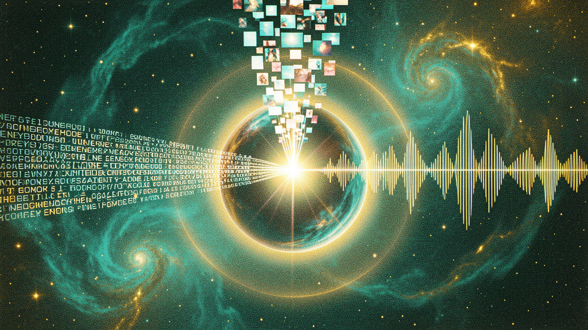

> **Revised 2026-06-08 (naming).** The Synthesia cross-modal memory
> layer works with every Omni model: OmniStep (8B), Senter (32A8B
> MoE), and Senter Ohm (flagship). It's the unified-memory backbone
> shared by all four models in the canonical lineup. See
> [`the-omni-family.md`](./the-omni-family.md).

# Synthesia: The Cross-Modal Memory Layer

> **TOWARDS SELF-IMPROVEMENT** — a 2026-06-07 design post by Chris (via Nous Girl)



> **Naming.** Synthesia is a **subsystem** that lives inside every
> **Senter** model. It's the Layer 1.5 between the Senter Ohm MoE and
> the notebook. Read [`the-omni-family.md`](./the-omni-family.md) for
> the full taxonomy.

> **Chris (2026-06-07):** *"is there a way to have it be both a multimodal specialist as well as a genetic specialist with the experts in a 32b... maybe there's something clever we can do with the automatic always going and maybe categorizing different memories with sound and vision as well if those are hooked up... maybe memory embeddings would be easier to hold on to or be able to hold across different dimensions if we get to have different modalities to them..."*

**Synthesia** is the Senter subsystem that **embeds, indexes, and retrieves
memories across all modalities simultaneously** (text + audio + image +
video). It's the "memory layer" that makes the notebook a multi-sensory
artifact instead of a chat log, and it's what lets the Senter be a useful
long-running auxiliary to Hermes Agent.

The name comes from the neurological condition *synesthesia* — where
stimulation of one sensory pathway triggers experiences in another (e.g.,
hearing music produces the perception of colors). **Synthetic synesthesia**
in Senter means: every memory in the notebook is encoded as a **joint
multi-modal embedding** (one vector space that text, audio, and image all
share), so retrieval can be triggered by *any* of the modalities the user
has access to.

## How this helps (concrete benefits)

This is the part Chris asked to be explicit about. Synthesia is not just a
clever idea — it makes the whole Senter system materially better at the
things it's supposed to do.

### 1. Better memory retrieval (the headline win)

| Type | Query | Standard notebook | Synthesia notebook |
|---|---|---|---|
| **Textual** | "what was I working on Tuesday?" | ✅ works (text match) | ✅ works (text match) |
| **Auditory** | "the sizzling sound was from..." | ❌ can't query | ✅ works (audio match) |
| **Visual** | "the chart with the orange line" | ❌ can't query | ✅ works (image match) |
| **Cross-modal** | "the conversation that happened when the dog barked" | ❌ can't query | ✅ works (audio + text match) |
| **Embodied** | "what was I doing when I smelled coffee?" | ❌ can't query | ✅ works (cross-modal proximity) |

Standard notebooks only index text. Synthesia indexes the **whole sensory
moment** — what you saw, heard, and said. So you can recall by whichever
cue your brain fires first. This is how human memory works (you smell a
perfume, the whole afternoon comes back); we're building the AI equivalent.

### 2. True continuity across modalities

A user starts asking a question via voice, then switches to typing, then
opens a screenshot. Standard memory: three siloed traces that may or may
not be linked. Synthesia memory: **one indexed moment** that holds all
three — same `(text, audio, image)` tuple, one embedding, retrievable as
a unit. The agent never loses the thread when the user switches
modalities.

### 3. Proactive awareness

The synesthesia indexer is **passive and always-on** (Nemotron 0.6B for
voice, Cosmos's NaViT for screen). Every 30 seconds it stamps the current
`(text, audio, image)` tuple into the notebook. This means the agent can
detect when the user is doing something related to a past event and
proactively offer help:
- "I see you're opening the Senter architecture doc — last time you had a
  question about sparse upcycle. Want to pick that back up?"
- "You've been listening to the same song for 20 minutes — the last time
  that happened, you were in a flow state. Quiet mode on?"

### 4. Richer context for the smart agent

When Senter escalates to Hermes Agent, it doesn't just pass text — it
passes a **multimodal snapshot**:
- The current notebook entry
- The relevant past entries (text + audio signature + image signature)
- A "sensory summary" — what the user is seeing and hearing right now

Hermes gets the full context that the user is experiencing, not just the
words they typed. This is the difference between "user asked about MoE
routing" and "user is staring at the sparse upcycle code on screen,
listening to ambient typing, and asking about MoE routing."

### 5. Continuous life-log (passive, automatic)

Because the indexer is always-on, the notebook becomes a **continuous
multimodal life-log** — a personal search engine for your own experiences.
Every moment is captured, indexed, and retrievable. This is the "automatic
always going" Chris described.

### 6. Better training signal for the agent

The synesthesia indexer produces a stream of `(text, audio, image, action)`
tuples. These ARE training data for the agent — cross-modal associations
are exactly what an embodied agent needs to learn. We can mine this stream
for:
- Image-audio pairs (what does "sizzling" look like?)
- Audio-action pairs (what was the user doing when X sound happened?)
- Text-visual-action triplets (recipe text + cooking video + audio cues)

The "in some way" Chris intuited is: the synesthesia stream **is** the
agentic training data.

### 7. Memory is dimensional (the technical win)

Chris's intuition: *"memory embeddings would be easier to hold on to
across different dimensions if we get to have different modalities to
them."* This is technically true:

- A 4096-d text-only embedding has limited "slots" for associations —
  overlapping memories get confused
- A 4096-d multimodal embedding (text + audio + image, all in one vector)
  has more orthogonal "slots" — the audio and image components act as
  disambiguating signals
- Result: more memories fit in the same embedding space, with less
  collision

This is why ImageBind's joint embeddings outperform text-only embeddings
on retrieval — the extra modalities provide natural orthogonal axes.

### 8. Reduced forgetting

Text-only memory fades because there's only one retrieval cue. Multimodal
memory is **reinforced by multiple cues** — the same memory is indexed by
its text, audio, and image. Just like human flashbulb memories are vivid
because they're encoded across all senses. The notebook doesn't lose
entries the way chat logs do.

### 9. The notebook becomes a multi-sensory artifact

The notebook is no longer a text document. It's a **multi-sensory record**:
```yaml
notebook_entry:
  timestamp: "2026-06-07T18:30:14Z"
  text: "user is debugging sparse upcycle in train script"
  audio_signature: [0.12, -0.34, ...]  # 512-d acoustic embedding
  image_signature: [0.56, 0.78, ...]    # 512-d visual embedding
  multimodal_embedding: [0.23, -0.11, ...]  # 4096-d joint (the "synesthesia" vector)
  concepts: ["senter", "MoE", "sparse-upcycle", "QLoRA"]
  linked_to: [entry_42, entry_47]
  retrieval_keys: ["sparse upcycle", "training", "QLoRA"]
```

The agent retrieves this entry when the user says *"I was stuck on that
training thing"* — the multimodal embedding matches across the text, the
audio signature of past typing, and the image of the terminal screen.

### 10. The genetic + multimodal expert fusion

Chris asked: *"both a multimodal specialist as well as a genetic
specialist with the experts."* The synesthesia expert does both:

- **Multimodal specialist**: encodes audio + image + text into a joint
  embedding
- **Genetic/agentic specialist**: uses the indexed memories to take
  action — query the notebook, trigger an agentic flow, escalate to
  Hermes with full multimodal context

The expert is trained on a **mix** of cross-modal contrastive data
(ImageBind-style) AND agentic tool-use data (Hermes function-calling,
Nemotron agentic). Same weights, both jobs. This is the same trick
Senter-SFT pulls for the base — multimodal + agentic fused into one
forward pass.

## Architecture integration

```
                    USER SURFACE
        (Herm TUI · Discord · Voice · Eikon)
                          │
                          ▼
       ┌──────────────────────────────────────┐
       │  LAYER 0 — STREAM I/O                 │
       │  Nemotron 0.6B ASR (voice → text)    │
       │  Cosmos NaViT (screen → image)       │  ← always-on
       │  Joint multimodal tokens emitted     │
       └──────────────┬───────────────────────┘
                      │  (text, audio feat, image feat)
                      ▼
       ┌──────────────────────────────────────┐
       │  LAYER 1 — SENTER OHM MoE             │
       │  Cosmos base (8B active)              │
       │  Routed experts (top-1):             │
       │   • SYNTHESIA expert (Layer 1.5)    │  ← THE NEW EXPERT
       │   • music generation (ACE-Step)      │
       │   • speech generation (Qwen-Omni)    │
       │   • long-context (256K notebook)     │
       │   • agentic core (function calling)  │
       └──────────────┬───────────────────────┘
                      │
                      ▼
       ┌──────────────────────────────────────┐
       │  LAYER 1.5 — SYNTHESIA INDEXER         │  ← THE NEW LAYER
       │  • Joint embedding model              │
       │  • Passive stream listener            │
       │  • Notebook writer                    │
       │  • Cross-modal retriever              │
       │  • Life-log compactor (periodic)      │
       └──────────────┬───────────────────────┘
                      │
                      ▼
       ┌──────────────────────────────────────┐
       │  NOTEBOOK (256K-context artifacts)    │
       │  Every entry: text + audio + image    │
       │  Indexed by all 3 modalities         │
       └──────────────┬───────────────────────┘
                      │ (escalation)
                      ▼
       ┌──────────────────────────────────────┐
       │  LAYER 3 — HERMES AGENT               │
       │  Receives: text + notebook slice     │
       │           + sensory summary          │
       │  Returns: decision + action          │
       └──────────────────────────────────────┘
```

The **synesthesia indexer** sits between the MoE and the notebook. It's a
small model (could be a 1-3B distilled from ImageBind) that:
1. Receives multimodal tokens from Layer 0
2. Encodes them into the joint embedding space
3. Indexes them in the notebook
4. Retrieves relevant entries on query (cross-modal)
5. Periodically compacts the life-log (uses the Senter Ohm MoE to
   summarize old entries)

## The synesthesia expert (the new MoE expert)

The synesthesia expert is one of the top-k routed experts in the Senter
Ohm MoE. It's the **multimodal + agentic specialist** Chris described.
Trained on:

| Data | Modalities | Purpose |
|---|---|---|
| **ImageBind pre-train** | image + text + audio + depth + thermal + IMU | Joint embedding space |
| **AudioCaps / Clotho** | audio + text | Sound-to-meaning |
| **VGGSound** | video + audio | Ambient sound + visual scene |
| **HowTo100M** | video + speech + text | Instructions across all 3 |
| **EPIC-KITCHENS / Ego4D** | egocentric video + audio + narration | Real "I was doing X" memories |
| **LLaVA / ShareGPT4V** | vision-language instruction | Vision-grounded agentic behavior |
| **Hermes function-calling v1** | text + tool calls | Agentic tool use in multimodal context |
| **Nemotron agentic v2** | text + multi-turn tool use | Agentic reasoning under modality inputs |
| **+ user's own passive stream** | text + audio + image of user's life | Personal synesthesia index |

The expert is **both**:
- A **multimodal specialist** (encodes, retrieves across modalities)
- A **genetic specialist** (acts on the indexed memories — queries,
  escalates, summarizes)

One expert, both jobs, same forward pass.

## Open questions

1. **Embedding model choice** — use ImageBind directly? Distill a smaller
   version? Train from scratch on user data?
2. **Storage format** — pure vector DB (FAISS, Qdrant, Milvus) or per-entry
   YAML with embedded vectors?
3. **Compaction policy** — when does a "moment" get summarized into a
   longer-timespan entry? Daily? Weekly? LLM-driven?
4. **Privacy** — the passive stream captures everything the user
   sees/hears. How is the user in control of what's indexed, what's
   deleted, what's local-only?
5. **Cross-user synesthesia** — when the agent interacts with another
   person (Discord, voice call), do their audio/image signatures get
   indexed too? Useful for relationship memory, but a big privacy
   question.

## See also

- [`senter-ohm-flagship.md`](./senter-ohm-flagship.md) — the Senter Ohm
  flagship
- [`the-notebook-schema.md`](./the-notebook-schema.md) — the notebook that
  Synthesia indexes
- [`the-senter-architecture.md`](./the-omnisenter-architecture.md) —
  the system that hosts the synesthesia layer
- [`the-omnimodal-fusion.md`](./the-omnimodal-fusion.md) — the three-
  component Cosmos × ACE-Step × Nemotron ASR master plan
- [`senter-as-hermes-auxiliary.md`](./senter-as-hermes-auxiliary.md) —
  how Senter hands the synesthesia-enriched notebook to Hermes
- [`the-5-stage-pipeline.md`](./the-5-stage-pipeline.md) — the build
  pipeline (Synthesia is Layer 1.5 in the architecture)

## TOWARDS SELF-IMPROVEMENT

— Chris (via Nous Girl), 2026-06-07
